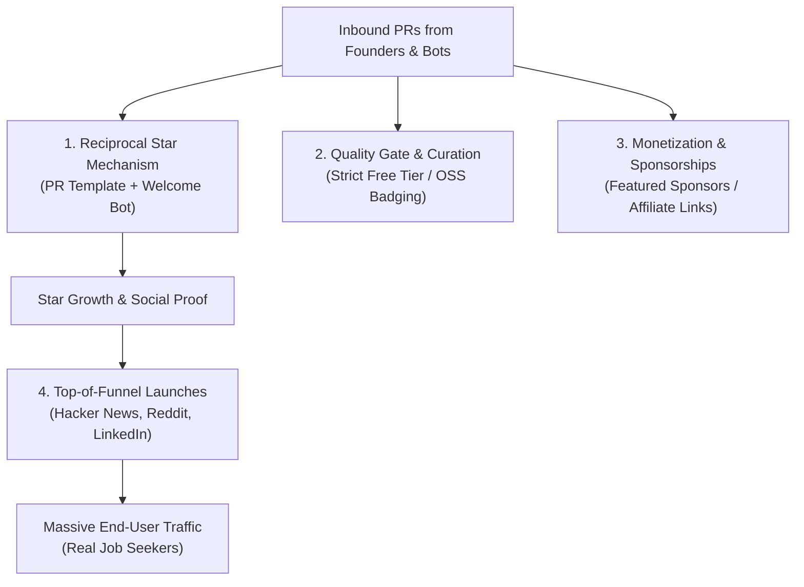

# awesome-job-seeking: Growth & Capitalization Strategy

An analysis of why [yuhonas/awesome-job-seeking](https://github.com/yuhonas/awesome-job-seeking) receives high pull request / contribution volume relative to stargazers, and an actionable roadmap to convert that momentum into audience growth, stars, and monetization.

---

## 1. Executive Summary & Current Metrics

| Metric | Count | Context |
| :--- | :--- | :--- |
| **Pull Requests** | **64+** | High volume of inbound PRs submitting tools |
| **Forks** | **29** | Primarily created to submit PRs |
| **Stars** | **16** | Disproportionately low compared to PRs/forks |
| **Bi-weekly Views** | **~78 views / 41 uniques** | ~3–5 unique visitors daily |
| **Top Referrer** | **Google (75%+)** | Inbound search traffic targeting job search directories |

In standard open-source repositories, stars outpace pull requests by an order of magnitude (typically 10:1 to 50:1). In `awesome-job-seeking`, PRs and forks exceed stars.

---

## 2. Root Cause Analysis

### A. Contributor Persona: "SaaS Vendors", Not "Consumers"

Almost 100% of contributors fall into one profile: **indie hackers, SaaS founders, growth marketers, or automated AI bots** submitting their own AI resume builder, interview prep assistant, or auto-apply script.

* **Objective:** Secure a high-domain-authority backlink (`github.com` has a Domain Authority of ~96) and distribution.
* **Mindset:** Purely transactional. They are not job seekers looking to bookmark resources for personal use; they drop a link and leave.

### B. High Discoverability by Marketers and AI Agents

* The repository ranks **#1 on GitHub search** for `"awesome job seeking"` and top 7 for `"awesome job"`.
* It is actively maintained with PRs regularly merged, signaling to automated scraping tools and startup directory submitters that the repo is alive.
* Several submissions originate directly from AI coding agents (e.g., Claude Code, automated outreach bots) executing tasks like *"Submit our SaaS to relevant awesome lists on GitHub"*.

### C. End-User Audience Gap

Stars come from end-users who find personal utility in a list and want to bookmark or support it. Because the repository has not yet had a dedicated distribution push to real job-seeker hubs (Hacker News, Reddit career subreddits, LinkedIn), traffic is currently dominated by tool authors rather than consumers.

---

## 3. Growth & Capitalization Roadmap



---

### Pillar 1: The Reciprocal Contribution Loop (PRs → Stars)

Founders submitting tools need your repository to rank well—the more visibility the repo gets, the more clicks their tool receives.

#### 1. Add a Reciprocal Star Checklist to [`.github/PULL_REQUEST_TEMPLATE.md`](file:///Users/yuhonas/ghq/github.com/yuhonas/awesome-job-seeking/.github/PULL_REQUEST_TEMPLATE.md)

Update the checklist to align incentives:

```markdown
### Checklist
* [ ] I've reviewed [CONTRIBUTING.md](../CONTRIBUTING.md) guidelines.
* [ ] This tool has a genuine permanent free tier with real utility (no bait-and-switch).
* [ ] ⭐ I have starred this repository (starring helps the list climb rankings, which drives more traffic to all featured tools).
```

#### 2. Implement an Automated PR Welcome Bot

Create a GitHub Actions workflow (`.github/workflows/pr-welcome.yml`) that triggers on newly opened PRs:

```yaml
name: PR Welcome

on:
  pull_request_target:
    types: [opened]

jobs:
  welcome:
    runs-on: ubuntu-latest
    permissions:
      issues: write
      pull-requests: write
    steps:
      - name: Welcome contributor and request star
        uses: actions/github-script@v7
        with:
          script: |
            const author = context.payload.pull_request.user.login;
            const message = `Thanks for contributing @${author}! 🎉\n\nTo help this list climb GitHub's rankings and drive more visibility to all featured resources (including yours!), please consider giving the repository a **⭐ star** if you haven't already.`;
            github.rest.issues.createComment({
              issue_number: context.issue.number,
              owner: context.repo.owner,
              repo: context.repo.repo,
              body: message
            });
```

---

### Pillar 2: Quality Gates & Moat Building

If every commercial freemium wrapper is merged without filter, the list becomes noisy and loses user trust.

1. **Category Tiering:**
   * Clearly separate **Open Source & Free** tools from **Commercial / Freemium** tools.
   * Add badges next to listings: `[Open Source]`, `[100% Free]`, or `[Freemium]`.
2. **Strict Verification Rules:**
   * Tools must offer ongoing free value (not merely a 3-day trial requiring a credit card).
   * Require submitters to include a 1-sentence explanation of what makes their tool genuinely distinct.
3. **Official Awesome Status:**
   * Once formatting strictly adheres to the [Awesome Manifesto](https://github.com/sindresorhus/awesome/blob/main/awesome.md), submit a PR to `sindresorhus/awesome` under the Career or Productivity sections for sustained organic discovery.

---

### Pillar 3: Monetization & Value Capture

Because creators are actively seeking placement, their commercial intent can be monetized.

1. **"Featured Tool of the Month" Sponsored Slot:**
   * Add a dedicated callout section at the top of the README or category headers:

     ```markdown
     ### 🌟 Featured Resource of the Month
     > [Tool Name](link) - One-sentence high-impact description. (Sponsored)
     ```

   * Charge a modest monthly fee ($50–$150/mo) or link to a GitHub Sponsors tier. Early-stage AI startups routinely spend marketing budget on directory placement.
2. **Affiliate Integration:**
   * Integrate affiliate links for established tools already in the guide (e.g., Hunter.io, LeetCode, Interviewing.io, Resume.io).
3. **Standalone Web Directory:**
   * Generate a lightweight static website (via Astro or Next.js deployed on GitHub Pages / Vercel) parsing `README.md`.
   * Web versions capture search engine traffic for queries like *"best free AI resume checkers 2026"* and allow for sponsored banners, newsletter capture, and a persistent *"Star on GitHub"* button.

---

### Pillar 4: Top-of-Funnel Distribution (Targeting Real Job Seekers)

To build a substantial star base (>1,000 stars), the repo needs eyes from actual job hunters:

1. **Hacker News (*Show HN*):**
   * Title: *"Show HN: Awesome Job Seeking – Curated free and open-source tools for the 2026 tech job market"*
   * Positioning: Focus on anti-predatory tools, open-source automation (like JobNavigator), and verified ATS research (like State of ATS 2026).
2. **Reddit Community Value Posts:**
   * Share informative summaries in subreddits like `r/cscareerquestions`, `r/resumes`, `r/recruitinghell`, and `r/EngineeringResumes`.
   * Post as an informative guide ("Here are 25 free tools to beat ATS filters without paying $40/mo") linking back to the repo as an open-source hub.
3. **Cross-Promotion:**
   * Add a brief cross-reference in your other high-visibility repositories (such as [free-exercise-db](https://github.com/yuhonas/free-exercise-db)) and pin it on your GitHub profile.

---

## 4. Ready-to-Use Launch Templates

### Hacker News (*Show HN*) Draft

**Title:** `Show HN: Awesome Job Seeking – Curated free and OSS tools for the modern job search`

**Body:**

> Hi HN,
>
> Finding a job right now is notoriously brutal, and the ecosystem is filled with predatory AI tools charging $40/month for basic OpenAI API wrappers, fake ATS "match scores", and generic resumes.
>
> I maintain an open-source curated repository of free, high-signal resources and tools for every stage of the job search:
> <https://github.com/yuhonas/awesome-job-seeking>
>
> Highlights include:
>
> * Real empirical ATS research (e.g. State of ATS 2026 data on what 700+ tech companies actually use)
> * Self-hosted & open-source job scrapers and application copilots (e.g. JobNavigator)
> * Privacy-first tools (like in-browser ATS checkers that don't store your resume)
> * Fair interview prep and salary transparency data
>
> All listings are filtered to ensure they have genuinely usable, non-predatory free tiers. Suggestions and additions from the community are very welcome!

### Reddit (`r/cscareerquestions` / `r/resumes`) Draft

**Title:** `A curated list of completely free & open-source tools to help with your tech job hunt (no paid resume-builder traps)`

**Body:**

> Hey everyone,
>
> Given how tough the market is right now, I got tired of seeing candidates pushed toward paid resume scanners and subscription traps that don't provide real value.
>
> We've been curating an open-source collection of verified free tools, datasets, and guides:
> <https://github.com/yuhonas/awesome-job-seeking>
>
> Some of the most useful sections:
>
> 1. **Understanding ATS:** Actual breakdown of what enterprise ATS parsers parse vs what marketing tools claim.
> 2. **Application Automation:** Open-source, self-hosted alternatives for tracking and streamlining applications.
> 3. **Salary & Negotiation:** Unvarnished salary percentile data (BLS, Levels).
>
> Hope this helps someone landing their next role. If you know of other great free/OSS tools, pull requests are open!
